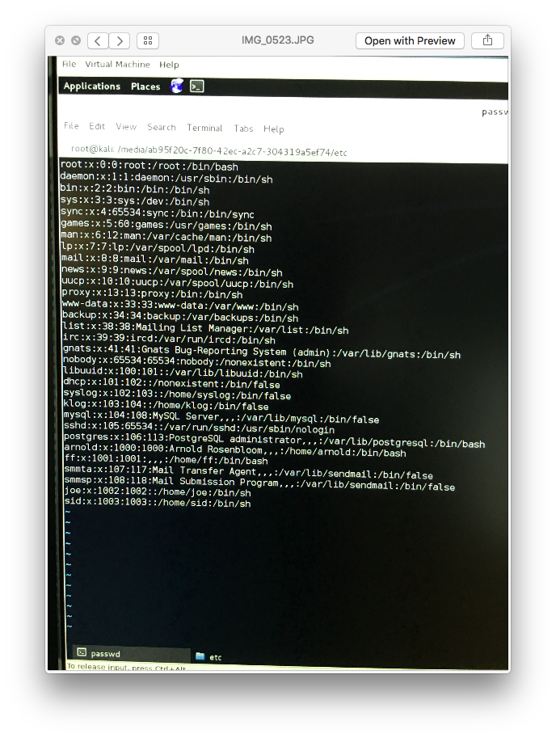

System Security: Problem 2

__Mounting the VM in Kali Linux__
One way to uncover the shadow files is to use "John the Ripper", a software available on Kali Linux, to obtain the data from the VM. 
The first thing we did is configure our Kali VM so that the ubuntu VM is loaded onto Kali as a bootable device. This way, we can access the data from 
the ubuntu VM's files onto the Kali VM. Since the Kali software now has access to the ubuntu password files, we can run john the ripper on the password file to obtain the specific password. Here are some relevant screenshots below to show the process and also the password we obtained for it. Once we have opened up the ubuntu virtual machine on Kali linux, we have access to the "passwd" and "shadow" files from the system seen below.

Here is the path the files were in: 

Finally, we can observe the output of John the Ripper with joe's password.  

For this execution, we could not run it for long due to time constraints, so we will assume the rest of the users (other than joe) have strong passwords. We can observe that joe has a weak password as it is "joeeoj", which is a palindrome of joe. However, since we are given "arnold"'s password in the assignment handout ("bpbthisisvulnerable2015"), we know it is a more secure password as John the Ripper was not able to identify it in a reasonable amount of time. 

__Accessing the root shell at login__
I followed the tutorial that we did on system hardening to access the same "passwd" and "shadow" file through the root shell on the ubuntu VM. We are allowed to do this because the BIOS has no password. We can avoid this by adding a password to the BIOS so that we cannot access the shell. Otherwise, we are able to access the system files and exploit them through this process.

http://www.cs.toronto.edu/~arnold/347/15f/tutorials/systemHardening/

