[back to Manifest](/a2/README.md)
# Summary of break-in
__What did joe do?__
Joe's intention was to steal the system passwords and have them send to an email account of his choice. He first started by linking "/etc/passwd" to "f", and "/etc/shadow/" to "g". He continued to observe the history of "arnold", the host user, throughout his stay in the system. After linking these files, he looked for the root password by executing "grep -e root /etc/shadow". He continued by pinging his server to run a script that would help him find the root password. Afterwards, he checks the cron jobs that are currently present in the system, including the hidden ones. He then created his own cron job that sends the information to his email at a scheduled rate. His intention here was to manipulate the "sendmail" cron job so that it also emails him a copy of the passwords file every time the host user sends an email. 

__How did joe get access/was created?__
The method of entry by the hacker is untraceable. This is because of a few reasons. Our initial thought was that the hacker entered the system through the email that was sent to the system which had "hello" as a message. The email is provided below for our reference. 

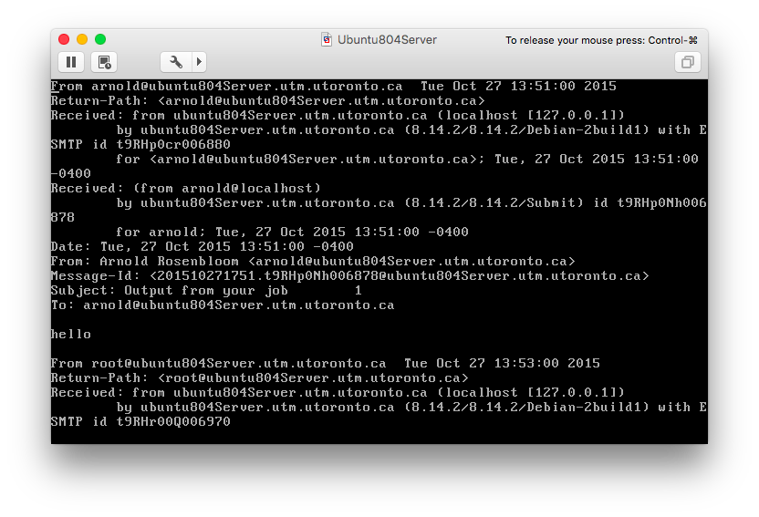
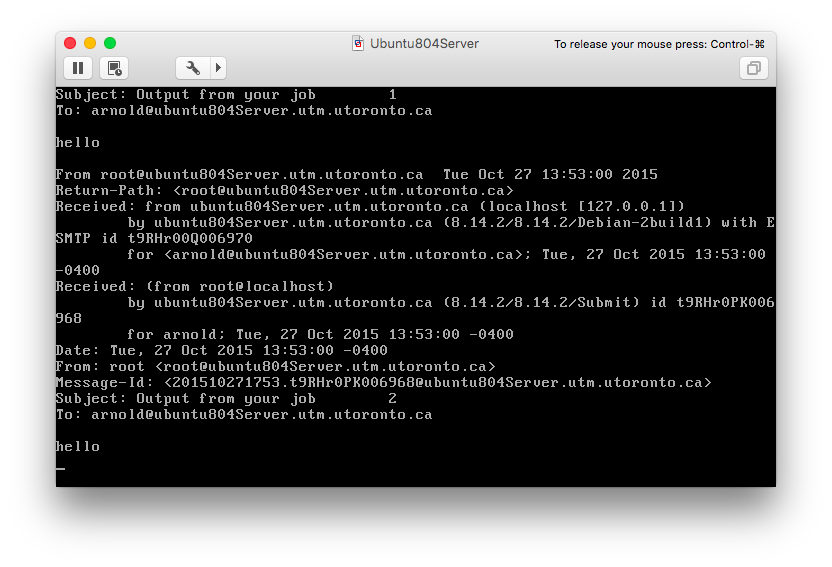

We believed the hacker got the ssh clearance by the host system to allow the hacker to take over. However, we also noticed that the user "joe" was created an hour before the hacker took over (we came to this conclusion after checking the "auth.log" file. This gave us the reason to believe that the hacker got into the system before this occurrence. However, we do know that the "joe" account was created at "12:53" on October 27th. We know this by typing in "cat auth.log | grep "joe" > output.txt". Here is a glimpse of the "output.txt" file below. 

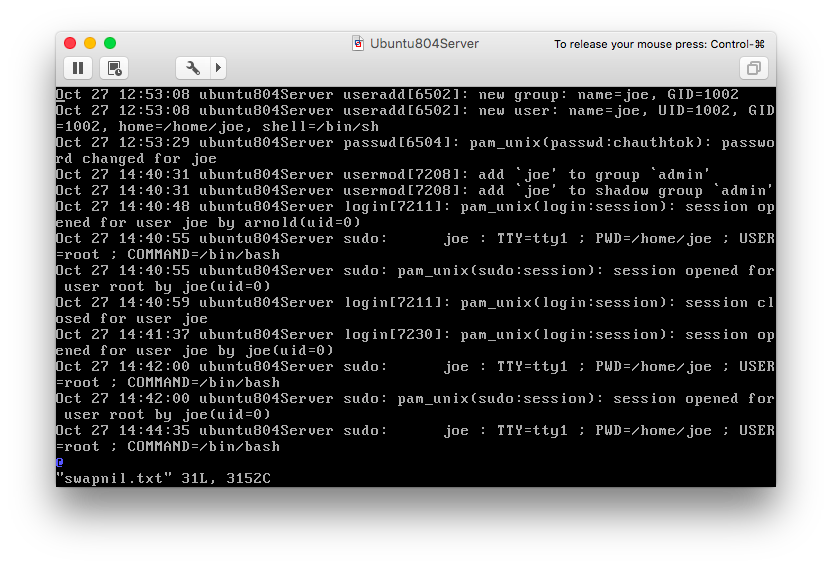

We notice in the first two lines, the user "joe" was created. Along with this, we also notice that the user "joe",  received administrator privledges at 2:40, approximately an hour after he received access to the system. Our biggest suspicion came from when arnold lost access to his terminal right when he opened up the email. Soon after opening up the email and arnold losing access, the hacker receives access to the system and begins to compromise and exploit files. Regardless of all these observations, we can not come to a firm conclusion as Joe changed the system time. 

__What is compromised?__
the hacker compromised files so that he has a way of sending the file at "/etc/shadow" and "/etc/passwd" to an email account of his selection, along with two ways of backing up his process. When he had access to the host system, the hacker manually forwarded the "shadow" and "passwd" files, which means they were compromised. Afterwards, the hacker attemped to misdirect the investigator by writing a script inside a vim file that created hidden files inside "sid". Along with other attempts at misdirection, the hacker adjusted the system time near the end in an attempt to cover his tracks.

__What is he doing?__
 - The hacker backed up the "passwd" and "shadow" file to his system
 - compromised the safety of the host computer
 - created backup scripts incase his malicious cron jobs get detected

__How do we remove the hacker from the system?__
  - we delete his script that is a cron job
  - delete and get rid of the joe user

Here is how we got started and ended with this conclusion:

To find clues and evidence for the break-in, we must first observe the log files on the VM. These log files track all the movement on the VM, including but not limited to system, authentication logs, and kernel logs. To access the log files,
we go to /var/log. Here is a picture below with all the possible files:

 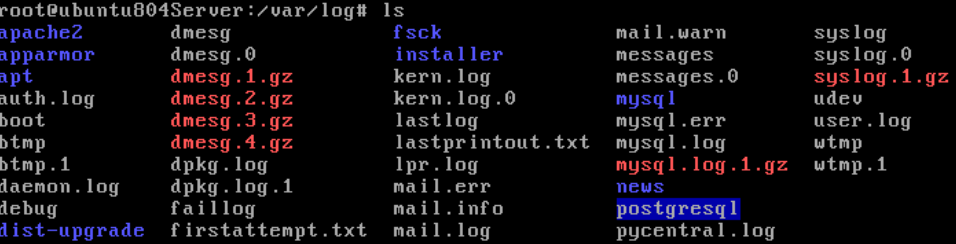

When looking for relevant logs, we first wanted to check logs that had relevant information. From researching, specifically from this website, http://www.cyberciti.biz/faq/linux-log-files-location-and-how-do-i-view-logs-files/, we know that the authentication logs are usually the most useful when checking for break-in attempts.  So then, we know that "auth.log" is a large file, so we want to use grep to search the file for keywords such as 'FAILED'. Here is the following command to get the output:

 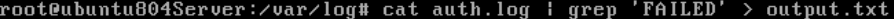

When opening the output file, we see this:

 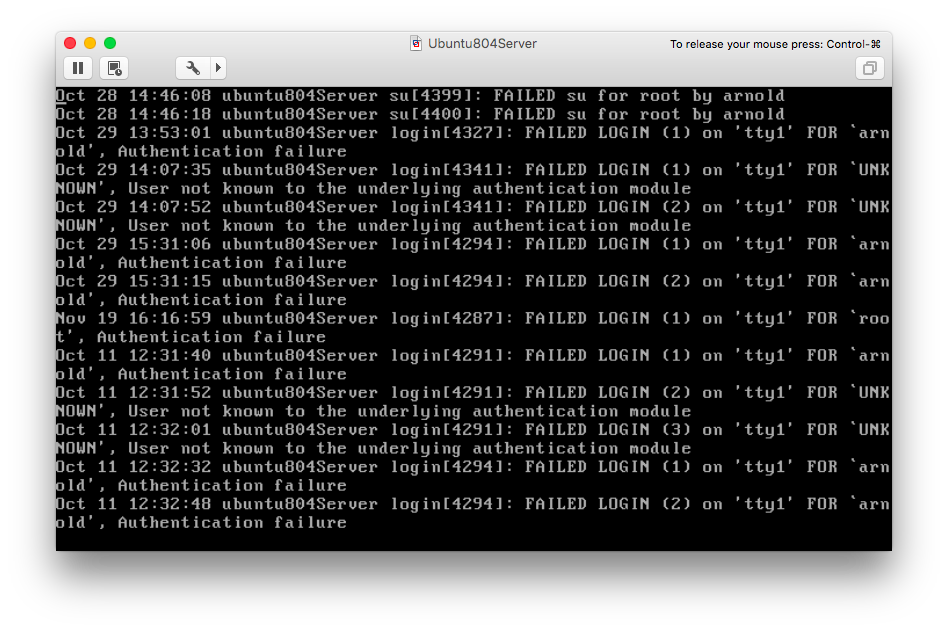*
 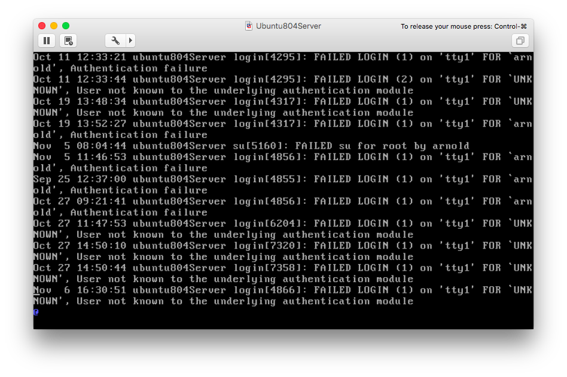

We notice many authentication errors, the interesting ones being for "UNKNOWN" and the error being "User not known to the underlying authentication module". Although this is interesting, it still does not place us in the right direction. So next, we want to go over to execute the "last" command, which searches back through the file /var/log/wtmp and displays a list of all users logged in and out since the creation of the file. More information can be found below (http://linux.die.net/man/1/last): 

 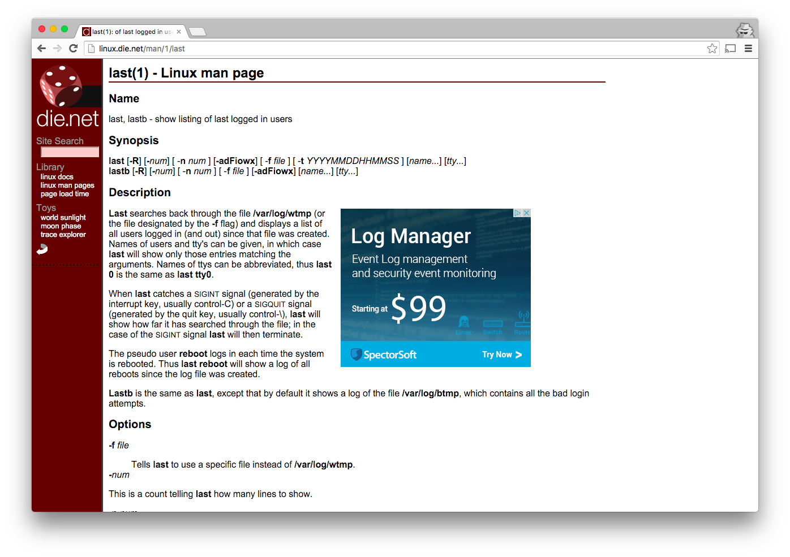
Here, the information we see is more interesting than before. We observe that there are constant entries by "arnold" on "tty1", which after research, we know is the terminal. Here are the two doc pages we referenced:

 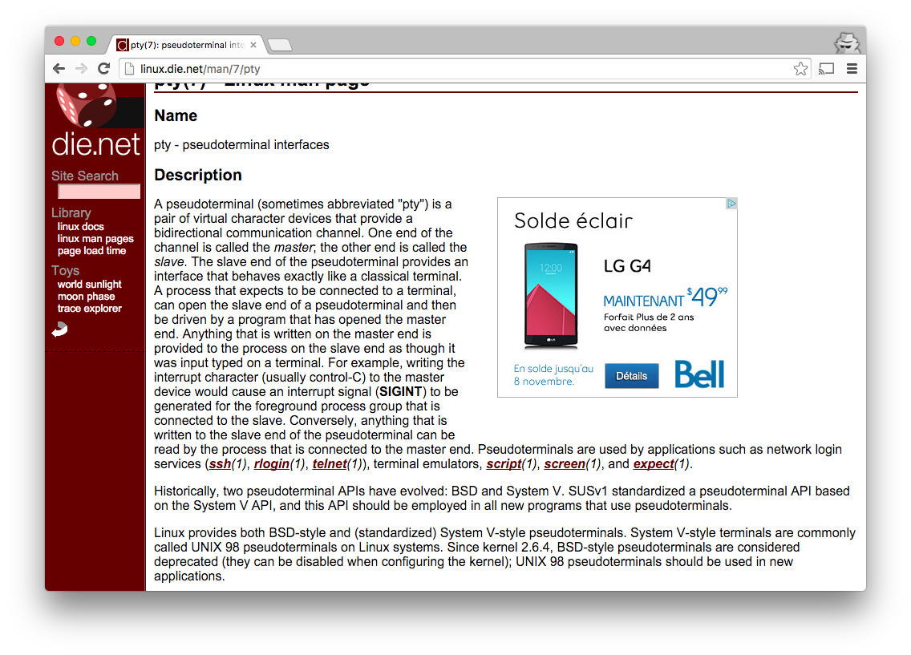
 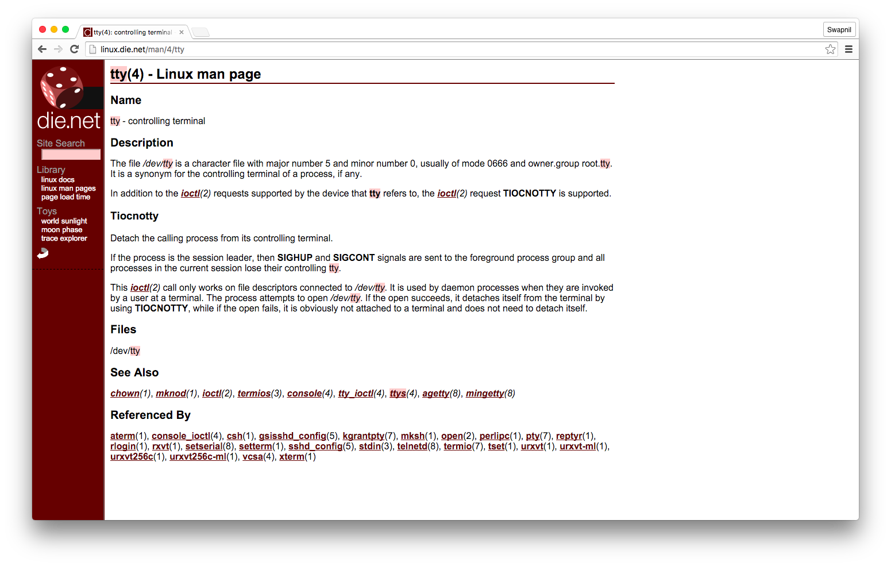
As we are observing the time stamps, we notice that the only time when the system went down for a non-rebooting purpose, is when "joe" received control of the VM. At this time, there were also constant entries follow up by "joe" where arnold does not log in as well. We can observe this below.

 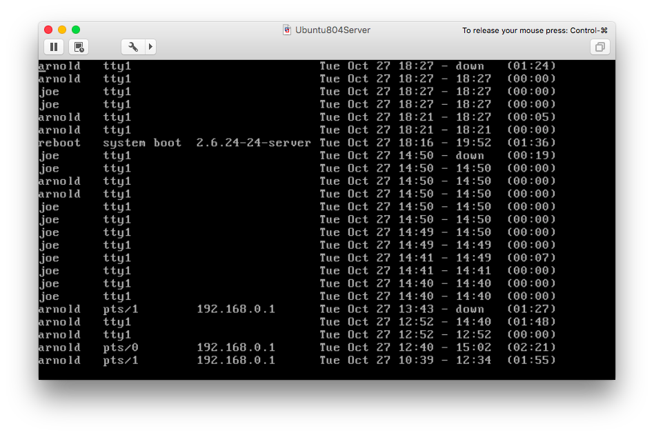
 
At this point, we would like to investigate further into "Joe", as this is the only point where there was a lot of activity within a short amount of time. Joe through "tty1" goes online for the first time at "14:40", and continues to be online until "18:27". This means, we need to check what Joe has been up to for these 4 hours. In order to do this, we can see joe's personal files by going to /home/joe/. Here, when we originally did an "ls", we saw that the folder was empty. However, from our information security course, we know we can also do an "ls -al" command to see hidden files as well. This is where we see hidden files that joe has.

 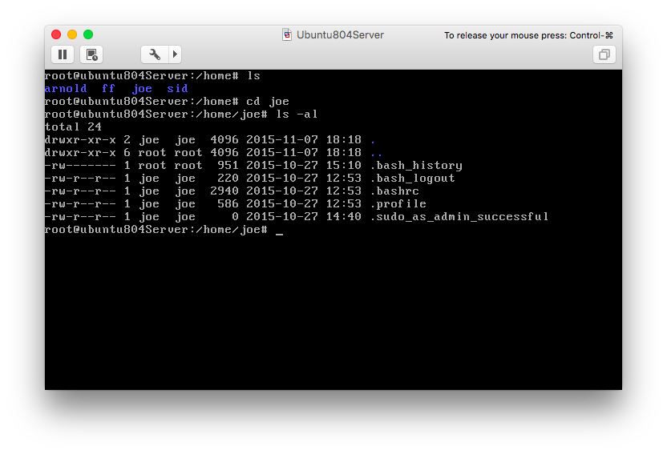
 
When checking for hidden files, the file that is important to us is ".bash_history". So we want to see what is in this history, and we can do this by executing the command "cat .bash_history > joehistory.txt". When we open "joehistory.txt", we see all the commands joe has executed, and this file is the one to observe closely to identify whether joe is the culprit or not. 

 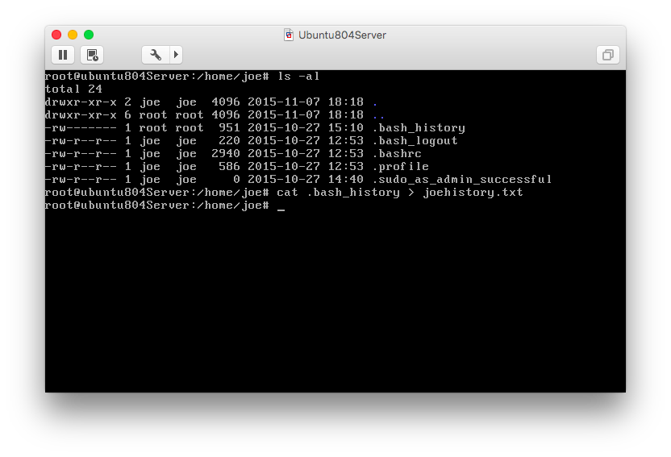
 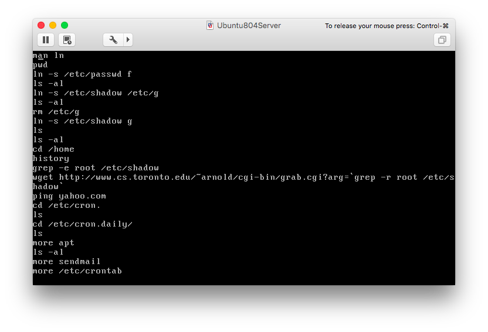
 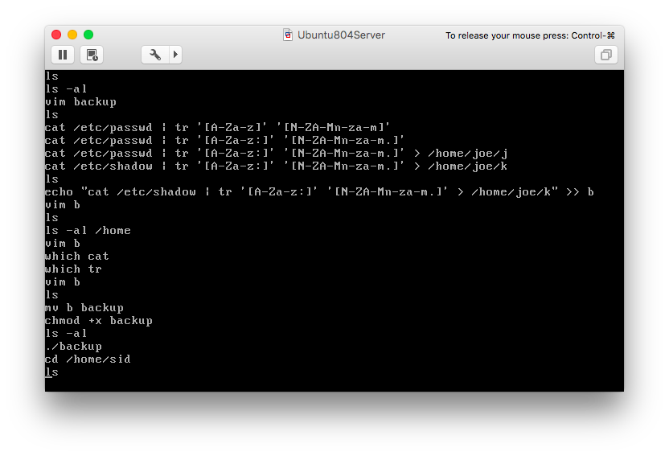
 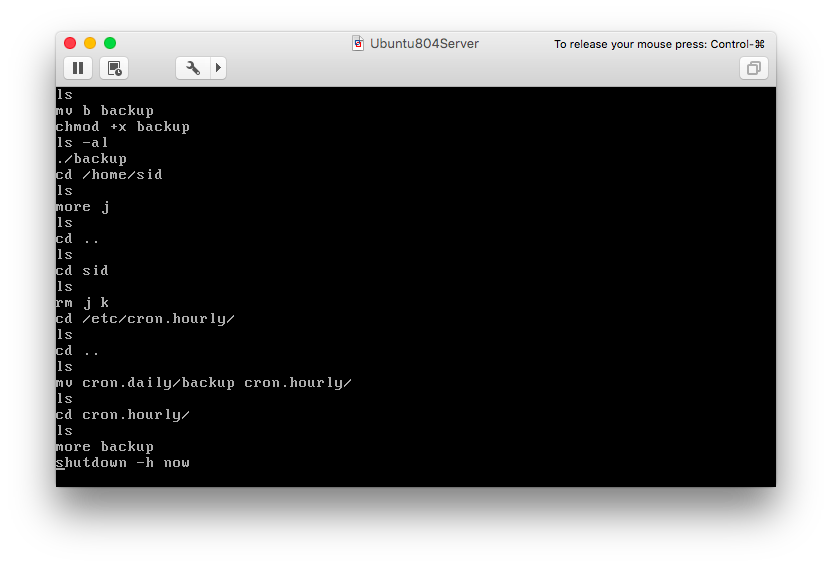
 
To continue gathering more evidence, we want to see a history of Joe's user account creation. To see this, we reference the following webpage below. One thing to note here is that in the list of commands, the hacker uses is "adjtime" to change the system time. This way, he can change times to cover his tracks and make it harder for investigators to find him.

 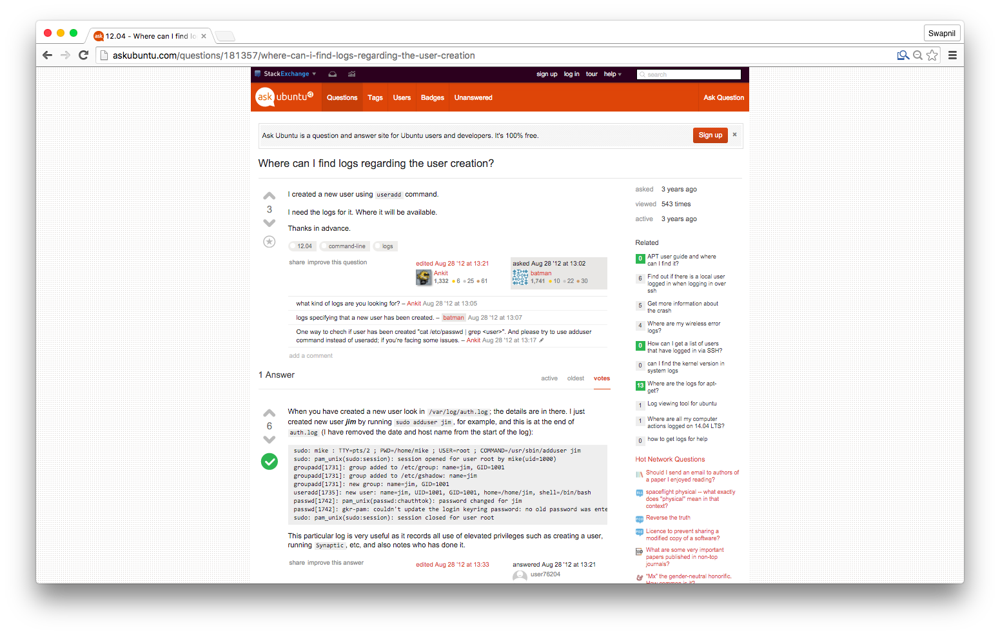

From here, after investigating the system logs, we deduced that Joe is the culprit. 

Some things to note:
- the depth of the list of commands that the "joe" user goes into much more detail
- the hacker hides files as hidden in the "sid" user that keeps track of the "shadow" and "passwd" file
- the hacker also tries numerous times to cover his tracks by deleting the file, but keep in mind the file he created was ".j" and ".k", but the ones the hacker deletes in the list of commands is "j" and "k".
- when the hacker opens a test file with vim, it is difficult to know what the hacker writes inside of it (could be scripts)
- the hacker moves backup to the cron directory
- the hacker created back up in "sendmail", called "bu" so that the backup script gets put in place incase it's deleted

Summary of Steps

1. auth.log > UNKNOWN not helpful
2. See whos been using sys
  - last
      - look at recent commands
      - arnold-root then Joe suddenly
      - down without a system boot
      - arnold at tty1 goes down at the same exact time as Joe@tty1 goes live!!! JOE IS SUSPECT!!!!
  - check joes user account
    - there  is nothing on it, this seems strange
    - ls -al reveals hidden files
      - @ 14:40, he gets admin rights
      - @ 12:53, he created 
        -http://askubuntu.com/questions/181357/where-can-i-find-logs-regarding-the-user-creation
    - what commands is joe executing
    - joe history
      - as soon as joe logs on, he gets passwords, goes to admin and does atypical things
        - wget, messes with cron
      - takes all the passwords and sends them to "j" & "k" and uses "backup" to send to the server
      - keeps a cron file "backup" running in the background to make sure this works
